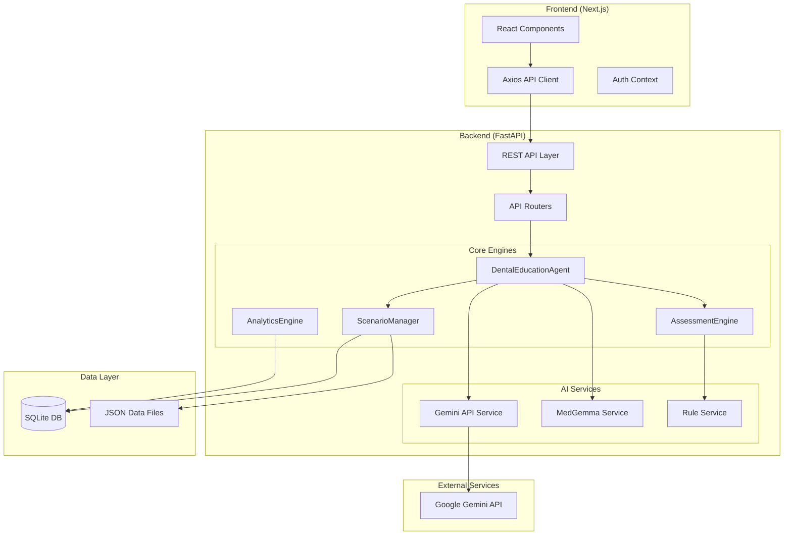
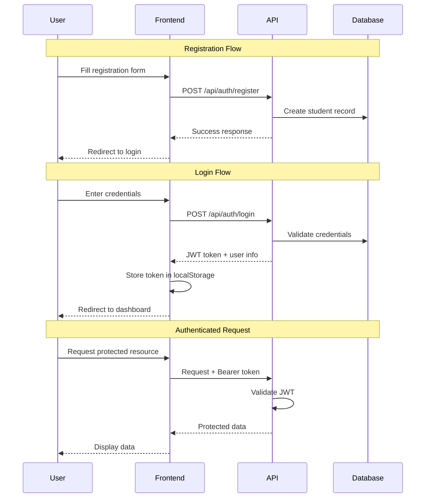
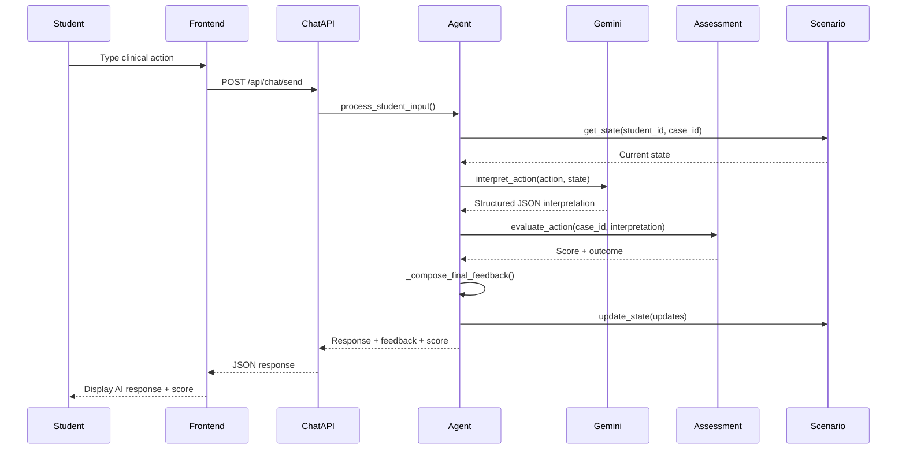

# 🦷 DentAI - Project Architecture

> **Dental Education AI Simulator**
> An intelligent, AI-powered dental education platform that simulates clinical patient encounters for dental students.

---

## 📋 Table of Contents

1. [Project Overview](#project-overview)
2. [System Architecture](#system-architecture)
3. [Technology Stack](#technology-stack)
4. [Directory Structure](#directory-structure)
5. [Backend Architecture](#backend-architecture)
6. [Frontend Architecture](#frontend-architecture)
7. [AI/ML Components](#aiml-components)
8. [Data Layer](#data-layer)
9. [API Reference](#api-reference)
10. [Authentication Flow](#authentication-flow)
11. [Core Workflows](#core-workflows)
12. [Configuration](#configuration)
13. [Development Guidelines](#development-guidelines)

---

## 🎯 Project Overview

**DentAI** is a comprehensive dental education simulator that leverages Google's Gemini AI to create realistic patient interaction scenarios. The platform enables dental students to:

- Practice clinical decision-making in a safe, simulated environment
- Receive real-time AI-powered feedback on their diagnostic approaches
- Track performance metrics and identify areas for improvement
- Experience diverse clinical cases with varying difficulty levels

### Key Features

| Feature                   | Description                                                             |
| ------------------------- | ----------------------------------------------------------------------- |
| **AI Patient Simulation** | Gemini-powered conversational AI simulating realistic patient responses |
| **Rule-Based Assessment** | Objective scoring system based on clinical protocols                    |
| **Performance Analytics** | Weakness detection and personalized recommendations                     |
| **Multi-Case Support**    | Diverse clinical scenarios (OLP, Periodontitis, Herpes, Behçet's, etc.) |
| **Student Profiles**      | Persistent progress tracking across sessions                            |
| **Bilingual Support**     | Turkish patient responses with English internal logic                   |

---

## 🏗️ System Architecture



### Architecture Patterns

- **Hybrid AI Pipeline**: Combines LLM interpretation with rule-based scoring
- **Silent Evaluator Architecture**: Background evaluation without interrupting conversation flow
- **RESTful API Design**: Clean separation between frontend and backend
- **Repository Pattern**: Abstracted data access through managers

---

## 🛠️ Technology Stack

### Backend

| Technology               | Purpose                         | Version |
| ------------------------ | ------------------------------- | ------- |
| **Python**               | Core language                   | 3.10+   |
| **FastAPI**              | REST API framework              | Latest  |
| **SQLAlchemy**           | ORM & database management       | Latest  |
| **SQLite**               | Persistent data storage         | -       |
| **Pydantic**             | Data validation & serialization | v2      |
| **Google Generative AI** | Gemini integration              | Latest  |
| **python-jose**          | JWT authentication              | -       |
| **Passlib**              | Password hashing (bcrypt)       | -       |

### Frontend

| Technology      | Purpose              | Version |
| --------------- | -------------------- | ------- |
| **Next.js**     | React framework      | 14+     |
| **TypeScript**  | Type-safe JavaScript | 5+      |
| **React**       | UI library           | 18+     |
| **Axios**       | HTTP client          | Latest  |
| **CSS Modules** | Scoped styling       | -       |

### AI/ML

| Technology                | Purpose                            |
| ------------------------- | ---------------------------------- |
| **Google Gemini**         | Primary LLM for patient simulation |
| **Gemini 2.5 Flash Lite** | Cost-effective model variant       |
| **Custom Rules Engine**   | Clinical protocol validation       |

---

## 📁 Directory Structure

```
dentai/
├── 📂 app/                          # Backend application core
│   ├── 📂 api/                      # FastAPI REST API
│   │   ├── 📂 routers/              # API endpoint routers
│   │   │   ├── auth.py              # Authentication endpoints
│   │   │   ├── chat.py              # Chat/conversation endpoints
│   │   │   └── cases.py             # Case management endpoints
│   │   ├── main.py                  # FastAPI app initialization
│   │   ├── deps.py                  # Dependency injection
│   │   └── __init__.py
│   │
│   ├── 📂 services/                 # External service integrations
│   │   ├── med_gemma_service.py     # MedGemma AI service
│   │   └── rule_service.py          # Rule processing service
│   │
│   ├── 📂 rules/                    # Clinical rule definitions
│   │   └── clinical_rules.py        # Rule implementations
│   │
│   ├── agent.py                     # 🧠 DentalEducationAgent (main AI orchestrator)
│   ├── assessment_engine.py         # 📊 Scoring & evaluation engine
│   ├── scenario_manager.py          # 🎭 Case/scenario state management
│   ├── analytics_engine.py          # 📈 Performance analytics
│   ├── student_profile.py           # 👤 Student data management
│   └── intake_questions.py          # ❓ Clinical question definitions
│
├── 📂 frontend/                     # Next.js frontend application
│   ├── 📂 app/                      # Next.js App Router pages
│   │   ├── 📂 chat/[caseId]/        # Dynamic chat page
│   │   ├── 📂 dashboard/            # Student dashboard
│   │   ├── 📂 login/                # Login page
│   │   ├── 📂 register/             # Registration page
│   │   ├── layout.tsx               # Root layout
│   │   ├── page.tsx                 # Home page
│   │   └── globals.css              # Global styles
│   │
│   ├── 📂 components/               # Reusable React components
│   │   ├── CaseHeader.tsx           # Case information header
│   │   └── ChatMessage.tsx          # Chat message component
│   │
│   ├── 📂 context/                  # React context providers
│   │   └── AuthContext.tsx          # Authentication state
│   │
│   ├── 📂 lib/                      # Utility libraries
│   │   └── api.ts                   # Axios API client
│   │
│   └── 📂 public/                   # Static assets
│
├── 📂 data/                         # Application data files
│   ├── case_scenarios.json          # Clinical case definitions
│   ├── scoring_rules.json           # Scoring rule configurations
│   ├── mcq_questions.json           # Multiple choice questions
│   └── student_profiles.json        # Student profile templates
│
├── 📂 db/                           # Database layer
│   └── database.py                  # SQLAlchemy models & session
│
├── 📂 assets/                       # Media assets (images, etc.)
│
├── 📂 pages/                        # Streamlit pages (legacy)
│
├── 📂 tests/                        # Test suite
│
├── main.py                          # Application entry point
├── requirements.txt                 # Python dependencies
├── requirements-api.txt             # API-specific dependencies
└── pytest.ini                       # Pytest configuration
```

---

## ⚙️ Backend Architecture

### Core Components

#### 1. DentalEducationAgent (`app/agent.py`)

The **central orchestrator** for the hybrid AI workflow:

```python
class DentalEducationAgent:
    """
    Orchestrates the hybrid AI workflow:
    - Uses Gemini to interpret student's raw text action into structured JSON
    - Uses AssessmentEngine for objective scoring against rules
    """
```

**Key Methods:**

| Method                      | Description                                              |
| --------------------------- | -------------------------------------------------------- |
| `interpret_action()`        | Converts raw student input to structured JSON via Gemini |
| `process_student_input()`   | Main pipeline: interpret → assess → compose feedback     |
| `_silent_evaluation()`      | Background MedGemma evaluation (non-blocking)            |
| `_compose_final_feedback()` | Generates final response for student                     |

**AI Prompt Architecture:**

- **Internal Logic**: English (action keys, scoring)
- **External Response**: Turkish (patient feedback)
- **Output Format**: Strict JSON schema

---

#### 2. AssessmentEngine (`app/assessment_engine.py`)

**Rule-based scoring engine** that evaluates interpreted actions:

```python
class AssessmentEngine:
    """
    Loads scoring rules and evaluates interpreted actions
    against case-specific rules.
    """
```

**Responsibilities:**

- Load scoring rules from `data/scoring_rules.json`
- Match interpreted actions against case-specific rules
- Return score, outcome, and state updates

**Response Structure:**

```json
{
  "score": 10,
  "score_change": 10,
  "rule_outcome": "Correct",
  "action_effect": "reveal_finding_001",
  "state_updates": {}
}
```

---

#### 3. ScenarioManager (`app/scenario_manager.py`)

**State management** for student-case sessions:

```python
class ScenarioManager:
    """
    Loads case scenarios and manages per-student scenario state.
    """
```

**Features:**

- Loads cases from `data/case_scenarios.json`
- Creates and retrieves student session states
- Persists state updates to SQLite database
- Supports case-specific initial state building

---

#### 4. AnalyticsEngine (`app/analytics_engine.py`)

**Performance analysis** and weakness detection:

```python
def analyze_performance(df: pd.DataFrame) -> Dict[str, Any]:
    """
    Analyze student performance and identify weaknesses.
    Returns: weakest_category, weakest_score, recommendation, category_performance
    """
```

**Capabilities:**

- Category-based performance analysis
- Weakness identification with recommendations
- Report generation (downloadable text format)

---

### API Layer

#### FastAPI Application (`app/api/main.py`)

```python
app = FastAPI(
    title="Dental Tutor AI API",
    description="RESTful API for dental education simulation platform",
    version="1.0.0"
)
```

**Configuration:**

- CORS enabled for frontend communication (ports 3000, 5173, 8000)
- API documentation at `/docs` (Swagger) and `/redoc`
- Health check endpoints at `/` and `/health`

---

### API Routers

#### Authentication Router (`app/api/routers/auth.py`)

| Endpoint             | Method | Description                  |
| -------------------- | ------ | ---------------------------- |
| `/api/auth/register` | POST   | Register new student account |
| `/api/auth/login`    | POST   | Authenticate and receive JWT |
| `/api/auth/me`       | GET    | Get current user info        |

#### Chat Router (`app/api/routers/chat.py`)

| Endpoint                                   | Method | Description                       |
| ------------------------------------------ | ------ | --------------------------------- |
| `/api/chat/send`                           | POST   | Send message, receive AI response |
| `/api/chat/history/{student_id}/{case_id}` | GET    | Retrieve chat history             |

#### Cases Router (`app/api/routers/cases.py`)

| Endpoint                      | Method | Description                           |
| ----------------------------- | ------ | ------------------------------------- |
| `/api/cases`                  | GET    | List all available cases              |
| `/api/cases/{caseId}`         | GET    | Get specific case (student-safe view) |
| `/api/cases/{caseId}/start`   | POST   | Start or resume session               |
| `/api/cases/{caseId}/session` | GET    | Get current session info              |

---

## 🎨 Frontend Architecture

### Next.js App Router Structure

```
frontend/app/
├── layout.tsx          # Root layout with providers
├── page.tsx            # Landing page
├── globals.css         # Global styles
│
├── login/
│   └── page.tsx        # Login form
│
├── register/
│   └── page.tsx        # Registration form
│
├── dashboard/
│   └── page.tsx        # Student dashboard
│
└── chat/[caseId]/
    └── page.tsx        # Dynamic chat interface
```

### Key Components

#### CaseHeader (`components/CaseHeader.tsx`)

Displays case metadata and session information:

- Case name and difficulty badge
- Patient profile summary
- Session score and progress

#### ChatMessage (`components/ChatMessage.tsx`)

Renders individual chat messages:

- Student vs AI message styling
- Timestamp display
- Score feedback indicators

### API Client (`lib/api.ts`)

Axios-based HTTP client with:

- **Request Interceptor**: Automatically attaches JWT token
- **Response Interceptor**: Handles 401 (unauthorized) errors globally
- **Timeout**: 30 seconds

**Exported API Objects:**

```typescript
export const authAPI = { register, login, getCurrentUser };
export const chatAPI = { sendMessage, getHistory };
export const casesAPI = { getAllCases, getCase, startSession, getSession };
```

### Context Management

#### AuthContext

Manages authentication state:

- JWT token storage (localStorage)
- User information (student_id, name)
- Login/logout functionality
- Auto-redirect on unauthorized

---

## 🤖 AI/ML Components

### Gemini Integration

**Model Configuration:**

```python
model_name = "models/gemini-2.5-flash-lite"  # Cost-effective default
temperature = 0.2  # Low temperature for consistent responses
```

**Prompt Engineering:**

The system uses a sophisticated prompt that instructs Gemini to:

1. Act as a **Clinical Dental Patient Simulator**
2. Output **strict JSON** responses
3. Distinguish between `CHAT` (greetings/questions) and `ACTION` (clinical steps)
4. Simulate realistic patient behaviors:
   - Vague initial responses
   - History downplaying
   - Visual metaphors for lesions

**Response Schema:**

```json
{
  "intent_type": "ACTION",
  "interpreted_action": "perform_oral_exam",
  "patient_response": "Turkish patient response...",
  "safety_concerns": [],
  "explanatory_feedback": "Brief explanation...",
  "structured_args": {}
}
```

### MedGemma Service (`app/services/med_gemma_service.py`)

Silent background evaluator for medical accuracy:

- Non-blocking evaluation
- Returns empty dict on failure (graceful degradation)
- Provides secondary validation layer

---

## 💾 Data Layer

### Database (SQLite)

**Location:** `db/database.py`

**Key Models:**

| Model            | Description                                                |
| ---------------- | ---------------------------------------------------------- |
| `Student`        | User account (student_id, name, password_hash, email)      |
| `StudentSession` | Per-case session (current_score, state_json, chat_history) |

### JSON Data Files

#### case_scenarios.json

Defines clinical cases with:

```json
{
    "case_id": "olp_001",
    "name": "Oral Liken Planus",
    "difficulty": "Orta",
    "patient": {
        "age": 45,
        "chief_complaint": "...",
        "medical_history": [...],
        "medications": [...],
        "allergies": [...]
    },
    "hidden_findings": [
        {
            "finding_id": "bulgu_001",
            "description": "...",
            "trigger_action": "perform_oral_exam",
            "media": "assets/images/..."
        }
    ],
    "correct_diagnosis": "Oral liken planus"
}
```

**Available Cases:**

| Case ID               | Name                                          | Difficulty |
| --------------------- | --------------------------------------------- | ---------- |
| `olp_001`             | Oral Liken Planus                             | Orta       |
| `perio_001`           | Kronik Periodontitis                          | Zor        |
| `herpes_primary_01`   | Primer Herpetik Gingivostomatitis             | Orta       |
| `infectious_child_01` | Primer Herpetik Gingivostomatitis (Pediatrik) | Zor        |
| `behcet_01`           | Behçet Hastalığı                              | Zor        |
| `syphilis_02`         | Sekonder Sifiliz                              | Zor        |
| `desquamative_01`     | Kronik Deskuamatif Gingivitis                 | Zor        |

#### scoring_rules.json

Defines scoring rules per case:

```json
{
  "case_id": "olp_001",
  "rules": [
    {
      "target_action": "perform_oral_exam",
      "score": 20,
      "rule_outcome": "Correct",
      "action_effect": "reveal_bulgu_001"
    }
  ]
}
```

---

## 🔐 Authentication Flow



**JWT Token Structure:**

- Stored in `localStorage` as `access_token`
- Automatically attached to requests via Axios interceptor
- 401 response triggers automatic logout and redirect

---

## 🔄 Core Workflows

### Student-Patient Interaction Flow



### Case Session Management

1. **Session Start**: `POST /api/cases/{caseId}/start`

   - Creates new session or retrieves existing
   - Initializes case-specific state

2. **During Conversation**: State persisted per message

   - Score accumulation
   - Revealed findings tracking
   - Chat history logging

3. **Analytics**: On-demand performance analysis
   - Category-based scoring
   - Weakness identification
   - Recommendation generation

---

## ⚙️ Configuration

### Environment Variables

| Variable              | Description           | Default                 |
| --------------------- | --------------------- | ----------------------- |
| `GEMINI_API_KEY`      | Google Gemini API key | Required                |
| `NEXT_PUBLIC_API_URL` | Backend API URL       | `http://localhost:8000` |
| `SECRET_KEY`          | JWT signing secret    | Required                |
| `DATABASE_URL`        | SQLite database path  | `db/dental_tutor.db`    |

### Development Servers

| Service  | Port | Command                             |
| -------- | ---- | ----------------------------------- |
| Frontend | 3000 | `npm run dev`                       |
| Backend  | 8000 | `uvicorn app.api.main:app --reload` |

---

## 📝 Development Guidelines

### Code Standards

- **Python**: Follow PEP 8, use type hints
- **TypeScript**: Strict mode enabled, explicit types
- **API Design**: RESTful conventions, consistent error responses

### Adding New Cases

1. Add case definition to `data/case_scenarios.json`
2. Add corresponding rules to `data/scoring_rules.json`
3. Add clinical images to `assets/images/` (if applicable)
4. Test with API endpoint `GET /api/cases`

### Extending the AI Agent

1. Modify prompt in `app/agent.py` for new behaviors
2. Add new action handlers in `AssessmentEngine`
3. Update state schema in `ScenarioManager` if needed
4. Test interpretation with various student inputs

### Running Tests

```bash
# Run all tests
pytest

# Run specific test file
pytest tests/test_auth.py -v

# Run with coverage
pytest --cov=app tests/
```

---

## 📊 Performance Considerations

- **Gemini Lite Model**: Optimized for cost vs. quality tradeoff
- **Low Temperature (0.2)**: Consistent, deterministic responses
- **Silent Evaluation**: Non-blocking background processing
- **SQLite**: Suitable for development/small deployments
- **Connection Pooling**: SQLAlchemy session management

---

## 🚀 Deployment Checklist

- [ ] Set production environment variables
- [ ] Configure CORS for production domain
- [ ] Enable HTTPS for API
- [ ] Set up database backups
- [ ] Configure rate limiting
- [ ] Enable logging and monitoring
- [ ] Review security headers

---

> **Last Updated**: December 2024  
> **Version**: 1.0.0  
> **Maintained by**: DentAI Development Team
