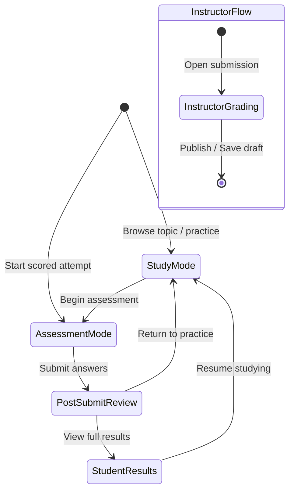

# S8A UX WORKFLOW REVIEW — Oral Pathology Learning Module

**Author:** AGENT-3 (Frontend / UX)
**Date:** 2026-05-07
**Status:** DRAFT — Pending Orchestrator Approval
**Input Documents:** S8A_PRODUCT_BRIEF.md, S8A_TAXONOMY.md
**Scope:** Design-only review. No code changes.

---

## 1. Mode Taxonomy — UI State Machine

The following five UI modes govern what data is visible and what actions are available. Every student-facing screen must map to exactly one mode at any given time.

### 1.1 Mode Definitions

| # | Mode | Trigger | Exit | Role |
|---|------|---------|------|------|
| M1 | **Study Mode** | Student opens topic/question in practice context | Student navigates away or switches to assessment | Student |
| M2 | **Assessment Mode** | Student starts a scored quiz/OE submission session | Student submits or timer expires | Student |
| M3 | **Post-Submit Review** | Student submits an assessment | Student navigates away | Student |
| M4 | **Instructor Grading** | Instructor opens a student submission for grading | Instructor publishes or saves draft | Instructor |
| M5 | **Student Results** | Student opens their results/progress view | Student navigates away | Student |

### 1.2 Mode Transition Diagram



---

## 2. Data Exposure Matrix

This matrix is the **binding contract** for what data may appear in each mode. Columns represent modes; rows represent data fields. ✅ = allowed, ❌ = forbidden, ⚠️ = conditional.

### 2.1 Question / Content Data

| Data Field | M1 Study | M2 Assessment | M3 Post-Submit | M4 Instructor | M5 Results |
|---|:---:|:---:|:---:|:---:|:---:|
| Question stem | ✅ | ✅ | ✅ | ✅ | ✅ |
| Options (MCQ) | ✅ | ✅ | ✅ | ✅ | ✅ |
| Topic tag | ✅ | ✅ | ✅ | ✅ | ✅ |
| Difficulty tag | ✅ | ❌ | ❌ | ✅ | ❌ |
| Bloom level tag | ❌ | ❌ | ❌ | ✅ | ❌ |
| Competency area tag | ✅ | ❌ | ❌ | ✅ | ⚠️ aggregate only |
| Theory links | ✅ | ❌ | ❌ | ✅ | ❌ |
| Course week tag | ❌ | ❌ | ❌ | ✅ | ❌ |

### 2.2 Answer / Grading Data

| Data Field | M1 Study | M2 Assessment | M3 Post-Submit | M4 Instructor | M5 Results |
|---|:---:|:---:|:---:|:---:|:---:|
| `correct_option` | ❌ | ❌ | ❌ | ✅ | ❌ |
| `correct_answer` | ❌ | ❌ | ❌ | ✅ | ❌ |
| `instructor_explanation` | ❌ | ❌ | ❌ | ✅ | ❌ |
| `model_answer_outline` | ❌ | ❌ | ❌ | ✅ | ❌ |
| `rubric_guide` | ❌ | ❌ | ❌ | ✅ | ❌ |
| `rubric_score_bands` | ❌ | ❌ | ❌ | ✅ | ❌ |
| Selected answer (student) | ✅ | ✅ | ✅ | ✅ | ✅ |
| `is_correct` (MCQ) | ❌ | ❌ | ✅ | ✅ | ✅ |
| Student-safe feedback | ❌ | ❌ | ✅ | ✅ | ✅ |
| Instructor written feedback | ❌ | ❌ | ⚠️ only if published | ✅ | ⚠️ only if published |
| Score (numeric) | ❌ | ❌ | ✅ MCQ only | ✅ | ✅ |
| Aggregate session score | ❌ | ❌ | ❌ (PENDING if OE ungraded) | ✅ | ⚠️ only if all components graded |

### 2.3 Internal / Evaluation Data

| Data Field | M1 Study | M2 Assessment | M3 Post-Submit | M4 Instructor | M5 Results |
|---|:---:|:---:|:---:|:---:|:---:|
| MedGemma output | ❌ | ❌ | ❌ | ❌ | ❌ |
| Validator audit log | ❌ | ❌ | ❌ | ❌ | ❌ |
| `safety_violation` internal flag | ❌ | ❌ | ❌ | ✅ | ❌ |
| `missing_critical_steps` | ❌ | ❌ | ❌ | ✅ | ❌ |
| `clinical_accuracy` internal | ❌ | ❌ | ❌ | ✅ | ❌ |
| Rule IDs | ❌ | ❌ | ❌ | ❌ | ❌ |
| Scoring internals / formulas | ❌ | ❌ | ❌ | ❌ | ❌ |
| Raw evaluator JSON | ❌ | ❌ | ❌ | ❌ | ❌ |
| Coach hint content | ❌ | ❌ | ❌ | ✅ | ❌ |
| `score_delta` per action | ❌ | ❌ | ❌ | ✅ | ❌ |

---

## 3. Existing Frontend Audit — Violations Found

### 3.1 CRITICAL — `/medgemma` Page Exposes Validator Internals

**File:** `frontend/app/medgemma/page.tsx`
**Sidebar link:** `frontend/components/Sidebar.tsx` line 18

**Violations:**
1. Page is **publicly navigable** — no auth guard, no role check
2. Exposes `safety_violation`, `is_clinically_accurate`, `missing_critical_info` directly to UI
3. Shows **raw JSON** of validator output via expandable accordion
4. References "MedGemma" by name in sidebar nav and page heading
5. Simulates validator output client-side (mock data includes `safety_violation: true/false`)

**Risk level:** CRITICAL — violates S7 student-safe boundary, S8A §7.1 (Authoring-Only), and project-wide rule "Do not expose raw MedGemma or validator details"

**Recommendation:** This page must be **removed from student navigation** in Sprint 8B. Two options:
- **Option A (recommended):** Delete the `/medgemma` route and remove its sidebar link entirely. It was a development demo and has no production role.
- **Option B:** Gate behind `AdminRouteGuard` if it has value as an admin debugging tool, rename to "Validator Debug Console", and never expose to students.

### 3.2 LOW — Sidebar Exposes "MedGemma" Label

**File:** `frontend/components/Sidebar.tsx` line 18
**Issue:** The sidebar link reads `label: "MedGemma"`, exposing an internal system component name to all authenticated users.
**Resolution:** Handled by §3.1 remediation. If Option B is chosen, the label must be changed.

### 3.3 INFO — Chat Page Score Display

**File:** `frontend/app/chat/[case_id]/page.tsx`
**Observation:** The chat page shows `currentScore` (cumulative session score) and per-message `+score puan` badges. This is the existing case simulation interface; the score display is a design decision from earlier sprints and appears intentional for the formative case workflow.
**S8A Impact:** Per §2.2, during **Assessment Mode** the score should not be shown (M2 column). However, the existing chat page operates in a hybrid study/practice context, not a formal assessment mode. If formal assessment mode is introduced in 8B, the score display must be togglable.

### 3.4 INFO — Quiz Page Correctly Student-Safe

**File:** `frontend/app/quiz/page.tsx`
**Observation:** Fully compliant with M2/M3 exposure rules. Uses `QuizQuestion` (no answer key), `QuizQuestionResult` (feedback-only), `QuizSubmitResponse` (score summary). No `correct_option` or `explanation` rendered. ✅

### 3.5 INFO — Instructor Session Detail Page Correctly Scoped

**File:** `frontend/app/instructor/sessions/[session_id]/page.tsx`
**Observation:** Protected by `InstructorRouteGuard`. Shows `validator_notes`, `coach_hints`, `score_delta`, `safety_violation`, `missing_critical_steps`, `faculty_notes` — all M4-allowed data. ✅

### 3.6 INFO — Admin Dashboard MedGemma Label

**File:** `frontend/app/admin/dashboard/page.tsx` line 114
**Observation:** Shows "MedGemma API" as a service health status label. This is admin-only (behind `AdminRouteGuard`), so it is acceptable per M4 rules. ✅

---

## 4. Screen Flow — Oral Pathology Learning Module

The following screens are required to support the S8A product brief. They are organized by navigation section. All screen descriptions are wireframe-level — no implementation.

### 4.1 Theory Browser (New Section)

**Route:** `/theory` (index) and `/theory/[topic_id]`
**Mode:** M1 (Study Mode)
**Role:** Student, Instructor, Admin

#### 4.1.1 Theory Index — `/theory`

| Element | Content |
|---------|---------|
| Page title | "Oral Patoloji Konuları" |
| Topic cards (grid) | One card per taxonomy topic: `topic_name_tr`, difficulty badge, competency area pills, mapped case link |
| Category grouping | Cards grouped by S8A_TAXONOMY categories (Immune-Mediated, Infectious, etc.) |
| Unmapped indicator | Topics with `unmapped_flag: true` show a muted "Vaka bekleniyor" badge instead of a case link |
| Search/filter | Optional: filter by difficulty, competency area |

#### 4.1.2 Theory Detail — `/theory/[topic_id]`

| Element | Content |
|---------|---------|
| Topic header | `topic_name_tr`, difficulty, competency pills |
| Key Clinical Features | Bulleted list from taxonomy |
| Diagnostic Tests | Bulleted list |
| Differential Diagnosis | Bulleted list |
| Safety Flags | If any, shown as warning badges (student-safe text, not rule IDs) |
| Linked Case | Button: "Bu konuyu vakada uygula → [case_name]" |
| Linked MCQ Practice | Button: "Bu konuda test çöz" → navigates to quiz filtered by topic |
| [REVIEW_NEEDED] gate | If case is `[REVIEW_NEEDED]`, the "Linked Case" button is disabled with tooltip "Bu vaka henüz onaylanmadı" |

**Data exposure note:** Theory detail shows `key_clinical_features`, `diagnostic_tests`, `differentials` — these are instructional content, not evaluation internals. Safe for M1.

### 4.2 Assessment Mode (Quiz Extension)

**Route:** `/quiz` (extended)
**Mode:** M2 → M3

The existing quiz page serves as the MCQ assessment interface. Extensions needed for S8A:

#### 4.2.1 Study vs. Assessment Toggle

| Study Mode (Current Default) | Assessment Mode (New) |
|---|---|
| Topic filter visible | Topic locked by assignment |
| Difficulty visible | Difficulty hidden |
| Theory links available | Theory links hidden |
| No time pressure | Timer visible (future) |
| Can change answers | Submit locks answers |
| Formative guidance note: "Pratik yapıyorsunuz" | Assessment label: "Değerlendirme" |

**Implementation note:** A single `mode: "study" | "assessment"` prop or URL param drives the conditional rendering. No separate page needed.

#### 4.2.2 Post-Submit Review (M3)

Already implemented. Shows:
- ✅ Selected option highlighted (green/red)
- ✅ Student-safe feedback text
- ✅ Score summary (%, correct, incorrect)
- ❌ Does NOT show correct answer
- ❌ Does NOT show explanation

No changes needed for M3.

### 4.3 Open-Ended Submission (New)

**Route:** `/quiz/open-ended/[question_id]` or integrated as a tab in quiz page
**Mode:** M2 → M3

#### 4.3.1 Submission View (M2)

| Element | Content |
|---------|---------|
| Question stem | Full question text |
| Topic tag | Visible |
| Competency tag | Hidden (assessment mode) |
| Text area | Student free-text answer input, min 50 chars suggested |
| Submit button | Disabled until minimum length met |
| Rubric | ❌ HIDDEN — never visible to student |
| Model answer | ❌ HIDDEN |
| Score bands | ❌ HIDDEN |

#### 4.3.2 Post-Submit View (M3)

| Element | Content |
|---------|---------|
| Student's submitted text | Read-only display |
| Status badge | "Gönderildi — Değerlendirme Bekliyor" (yellow) |
| Instructor feedback | ❌ Hidden until published |
| Score | ❌ Hidden until published |
| Re-submit button | ❌ Not available (one attempt) |

### 4.4 Instructor Grading Panel (New)

**Route:** `/instructor/grading` (index) and `/instructor/grading/[submission_id]`
**Mode:** M4
**Guard:** `InstructorRouteGuard`

#### 4.4.1 Grading Queue — `/instructor/grading`

| Element | Content |
|---------|---------|
| Page title | "Değerlendirme Kuyruğu" |
| Filter controls | By question, by student, by status (pending/graded/draft) |
| Submission list | Table: student name, question title, topic, submitted_at, status badge |
| Status badges | Bekliyor (yellow), Taslak (gray), Yayınlandı (green) |
| Click action | Opens grading detail |

#### 4.4.2 Grading Detail — `/instructor/grading/[submission_id]`

| Element | Content |
|---------|---------|
| Question prompt | Full question text |
| Student answer | Read-only display |
| Rubric guide | ✅ Visible (M4-allowed) |
| Score bands | ✅ Visible |
| Model answer outline | ✅ Visible |
| Score input | Numeric, validated against rubric max |
| Feedback text area | Instructor free-text feedback |
| Action buttons | "Taslak Kaydet" (save draft), "Yayınla" (publish to student) |
| Published indicator | After publishing: locked with "Yayınlandı ✅" badge |

### 4.5 Student Results View (Extended)

**Route:** `/statistics` or `/results` (TBD — extend existing statistics page)
**Mode:** M5

#### 4.5.1 MCQ Results Section

| Element | Content |
|---------|---------|
| Topic-level summary | Table: topic, attempted, correct, percentage |
| Competency heatmap | Aggregate C1–C5 scores across topics |
| Score trend | Chart: score % over time (existing recharts infra) |

#### 4.5.2 Open-Ended Results Section

| Element | Content |
|---------|---------|
| Submission list | Table: question title, submitted_at, status, score (if published) |
| Published feedback | Visible inline when instructor has published |
| Pending indicator | "Değerlendirme bekleniyor" if not yet graded |
| Score display | Numeric score shown only after instructor publishes |

#### 4.5.3 Aggregate Score

| Element | Content |
|---------|---------|
| Aggregate formula display | MCQ (35%) + OE (40%) + Case (25%) |
| Aggregate value | Shown ONLY if all three components are graded |
| Pending state | If OE is ungraded: "Açık uçlu değerlendirme tamamlanınca hesaplanacak" |

### 4.6 Assistant Panel Extensions

**Location:** Right panel in `/chat/[case_id]`
**Mode context:** Varies by session state

| Session State | Panel Content |
|---|---|
| Active session (M2-equivalent) | Discovered findings, competency area indicators (no theory links, no MCQ widget) |
| Post-session study review (M1) | Discovered findings + "İlgili Konu" theory links + MCQ progress widget + OE submission status |

**Boundary preserved:** Panel never coaches, hints, diagnoses, or evaluates. Theory links appear only in post-session state.

---

## 5. Navigation Structure Update

### 5.1 Student Sidebar (Updated)

```
Home              → /dashboard
Konular           → /theory         (NEW — replaces MedGemma link)
Klinik Bilgi Testi → /quiz
Vaka Kütüphanesi  → /cases
Sonuçlarım        → /statistics     (extended with OE results)
Profilim           → /profile
```

**Changes from current:**
1. ❌ Remove `/medgemma` link
2. ✅ Add `/theory` ("Konular") link
3. Labels in Turkish per existing convention

### 5.2 Instructor Sidebar Addition

The existing instructor portal (`/instructor/dashboard`, `/instructor/students/[id]`, `/instructor/sessions/[id]`) gains:

```
Değerlendirme Kuyruğu → /instructor/grading    (NEW)
```

### 5.3 Admin Sidebar — No Changes

Admin portal is unaffected by S8A learning module additions.

---

## 6. Turkish UI Labels (Binding)

All new UI surfaces must use Turkish labels consistent with the existing project convention.

| English Concept | Turkish Label |
|---|---|
| Theory / Topics | Konular |
| Study Mode | Çalışma Modu |
| Assessment Mode | Değerlendirme Modu |
| Open-Ended Question | Açık Uçlu Soru |
| Submit | Gönder |
| Pending | Bekliyor |
| Graded | Değerlendirildi |
| Published | Yayınlandı |
| Draft | Taslak |
| Rubric | Değerlendirme Ölçütleri |
| Competency Area | Yetkinlik Alanı |
| Aggregate Score | Toplam Puan |
| Score Pending | Puan Hesaplanıyor |
| Theory Link | Konu Bağlantısı |
| Grading Queue | Değerlendirme Kuyruğu |
| Linked Case | İlişkili Vaka |
| Safety Warning | Güvenlik Uyarısı |

---

## 7. Responsive Layout Notes

| Screen | Desktop | Tablet | Mobile |
|---|---|---|---|
| Theory index | 3-column grid | 2-column grid | 1-column stack |
| Theory detail | Full-width content | Full-width | Full-width |
| Quiz (MCQ) | Existing responsive layout — no changes | — | — |
| OE submission | Full-width textarea | Full-width | Full-width |
| Grading detail | 2-column (student answer left, rubric right) | Stacked | Stacked |
| Results / stats | Charts + tables, existing recharts infra | Scrollable | Scrollable |
| Assistant panel | Right panel (existing) | Collapsible drawer | Bottom sheet |

---

## 8. Risks and Open Questions

### 8.1 Risks

| # | Risk | Severity | Mitigation |
|---|------|----------|------------|
| R1 | `/medgemma` page remains accessible to students | CRITICAL | Must be removed or role-gated before Sprint 8B deployment |
| R2 | Mode toggle (study vs. assessment) could be manipulated client-side | MEDIUM | Mode enforcement must be server-driven (backend returns mode-appropriate payload) |
| R3 | Aggregate score displayed before OE grading | MEDIUM | Frontend must check `oe_graded` flag; show PENDING if false |
| R4 | Theory links shown during assessment mode | LOW | Mode-conditional rendering with `mode !== "assessment"` guard |
| R5 | Instructor publishes grade but student doesn't see it (no notifications) | LOW | Accepted per DECISION-075; polling/manual refresh is MVP behavior |

### 8.2 Open Questions for Orchestrator

| # | Question | Impact |
|---|----------|--------|
| Q1 | Should the theory browser (`/theory`) be a separate sidebar section or a sub-tab within the existing `/cases` page? | Navigation structure |
| Q2 | Should the study/assessment mode toggle live in the quiz page header, or should there be separate URL routes (`/quiz/practice` vs `/quiz/assessment`)? | URL design, backend contract |
| Q3 | For the instructor grading panel, should `InstructorRouteGuard` be extended to also grant access to admin users, or should admin use a separate admin grading view? | RBAC |
| Q4 | Should the competency heatmap in student results use the existing recharts dependency, or should a simpler table-based visualization be used for MVP? | Implementation complexity |

---

## 9. Summary of Deliverables

| Item | Status |
|------|--------|
| Mode taxonomy (5 modes) | ✅ Defined in §1 |
| Data exposure matrix (binding) | ✅ Defined in §2 |
| Existing frontend audit | ✅ 6 findings in §3 (1 CRITICAL, 1 LOW, 4 INFO) |
| Screen flow proposals (wireframe-level) | ✅ 6 screen groups in §4 |
| Navigation structure update | ✅ Defined in §5 |
| Turkish label registry | ✅ Defined in §6 |
| Responsive layout notes | ✅ Defined in §7 |
| Risks and open questions | ✅ 5 risks, 4 questions in §8 |

---

*End of S8A UX Workflow Review*
*Next: Orchestrator review → AGENT-7 safety review (S8A-T5) → Sprint 8B task generation*
